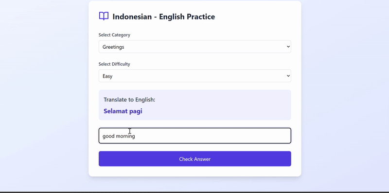

# 🇮🇩 Indonesian-English Translator Practice App

Aplikasi latihan menerjemahkan dari Bahasa Indonesia ke Bahasa Inggris secara otomatis menggunakan **Google Gemini API**. Cocok untuk belajar kosakata dan kalimat sehari-hari dengan pilihan **kategori** dan **tingkat kesulitan**.

 <!-- Tambahkan screenshot app kamu di sini -->

---

## 🚀 Fitur Utama

- 🔁 Soal otomatis dari AI (Google Gemini)
- 🗂️ Pilihan kategori: Greetings, Daily Activities, Food, Numbers
- 🎯 Tingkat kesulitan: Easy, Medium, Hard
- ✅ Feedback langsung: benar atau salah
- 🧠 Soal baru muncul otomatis setelah jawaban benar

---

## 🛠️ Teknologi

- ⚛️ React + TypeScript
- 💨 Tailwind CSS
- 🧠 Google Gemini API
- 🎨 Lucide Icons

---

## 📦 Instalasi

```bash
git clone https://github.com/danielaugust67/Translatify.git
cd indonesia-english-practice
npm install
```

---

## 🔑 Konfigurasi API

1. Dapatkan API key dari [Google AI Studio](https://makersuite.google.com/)
2. Buat file `.env` di root project:

```env
VITE_GEMINI_API_KEY=your_google_gemini_api_key
```

3. Update `gemini.ts`:

```ts
const URL = `https://generativelanguage.googleapis.com/v1/models/gemini-2.0-flash:generateContent?key=${import.meta.env.VITE_GEMINI_API_KEY}`;
```

---

## ▶️ Menjalankan App

```bash
npm run dev
```

---

## 🧪 Build (untuk production)

```bash
npm run build
```

---

## 📄 Lisensi

MIT © [Daniel](https://github.com/danielaugust67)

---

## 🤝 Kontribusi

Pull request sangat diterima! Jangan ragu untuk fork dan kembangkan aplikasi ini lebih lanjut 🚀
